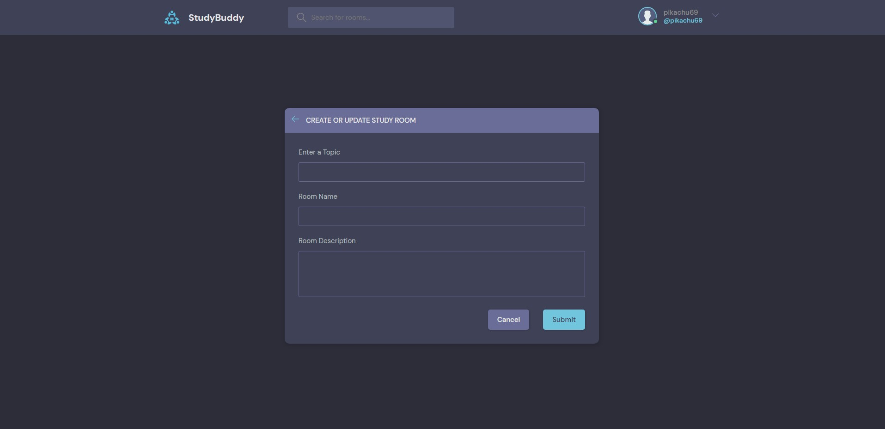

# studybud
A django based social network website

## What can we do from StudyBud?
A user can got to this site and ask for any help or make discussion regarding any topics, just like stackoverflow and others can help. One can also search 
topics he is interested in and see what others have posted regarding same topic.

## How to run this project?
Downlod/Pull the entire folder, download all the dependencies, install django
Then go to cmd and run

```
python manage.py runserver
```

## Requirements
Python3 <br/>
django


# Preview of our website
## Home Page
This is the homepage one can see, the recent posts will be shown on timeline. The recent activities can also be observered from this page.


## Register Page
The user can create account from this page providing the following informations.


## Login Page
The user can Login using email and password he provided during creating account


## Room Creation Form
A registered user can create a room/ post regarding the topic he wants to discuss.



## Profile Page
Ones profile can be observed where his profile pic, Bio and activities are preserved.


